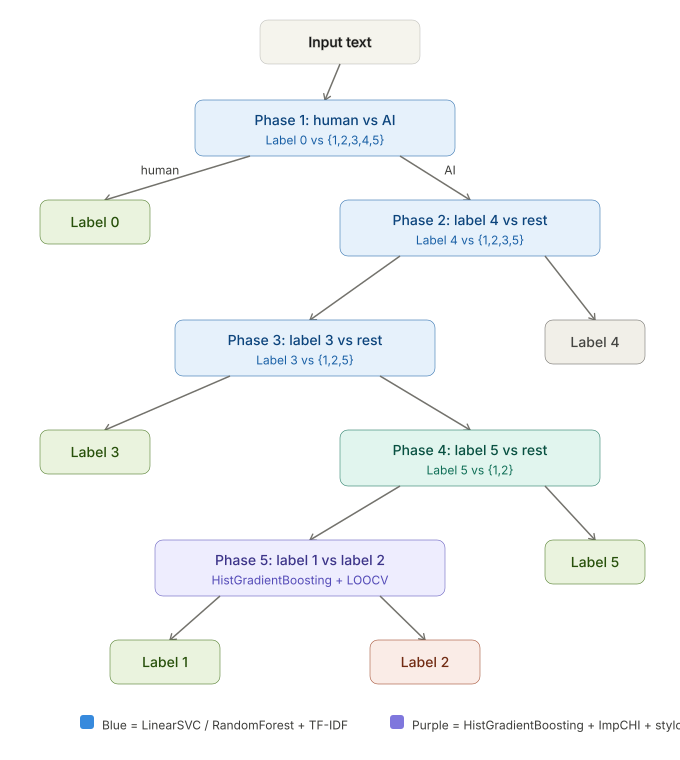

# AI Text Detection, 5-Phase Hierarchical Cascade

A multi-class text classification system that identifies whether a text is human-written or AI-generated, and if AI-generated, which model produced it. The classifier assigns one of six labels (0–5) and is evaluated on **macro F1 score**.

## Core Idea

Instead of tackling the 6-class problem directly, the pipeline decomposes it into a cascade of five binary decisions. Each phase peels off the easiest-to-separate class from the remaining pool, leaving the hardest distinction - Label 1 vs Label 2 - for last, where a specialised model with richer features takes over.

| Phase | Decision | Model | Features |
|-------|----------|-------|----------|
| 1 | Human, Label 0 vs AI {1,2,3,4,5} | LinearSVC | TF-IDF |
| 2 | Label 4 vs {1,2,3,5} | LinearSVC | TF-IDF |
| 3 | Label 3 vs {1,2,5} | LinearSVC | TF-IDF |
| 4 | Label 5 vs {1,2} | LinearSVC | TF-IDF |
| 5 | Label 1 vs Label 2 | HistGradientBoosting / LightGBM | ImpCHI + 30 stylometric features |

**ImpCHI** (Improved Chi-squared) selects the top-K most discriminative TF-IDF terms *per class* rather than globally, preventing the majority class from drowning out the minority class's vocabulary.

**Stylometric features** (30 dimensions) capture writing style: punctuation rates, POS-tag distributions, sentence/word length statistics, type-token ratio, and more.

## How the Model Evolved

### Submissions 2–6

A single LinearSVC with shared C across all four initial phases, plus a HistGradientBoostingClassifier for Phase 5. All hyperparameters tuned via a prior Optuna run (10-fold CV). Best CV F1 ≈ 0.9596.

### Phase 5 Isolation (`phase5_tuning.ipynb`, submissions 7–11)

Phase 5 (Label 1 vs 2, only ~240 samples) is the bottleneck. A dedicated Optuna study with **Leave-One-Out Cross-Validation** explored HistGB vs LightGBM, different stylometric subsets, and ImpCHI configurations across 1,200 trials. Interestingly, LOOCV favoured LightGBM, but plugging those configs back into the full pipeline didn't always improve end-to-end scores - a sign of either limited trials or overfitting to the tiny LOO splits.

The notebook also tested **probability-averaging ensembles** of the top-5 LOOCV models (all C(5,k) combinations for k = 2–5) to check whether blending probabilities could push F1 further.

### End-to-End Tuning with Voting and Per-Phase C (`tuning.ipynb`, submissions 12–18)

The full pipeline was re-tuned end-to-end with two new structural degrees of freedom:

- **Per-phase C**: instead of sharing a single regularization strength, each of the four LinearSVC phases gets its own C. This lets the model apply aggressive regularization where classes separate easily and relax it where the boundary is tighter.
- **Majority-vote ensembles for Phases 1–4**: three LinearSVC models with different C values vote on each phase's decision, reducing variance from any single regularization choice.

Phase 5 also gained a voting option (main model + two auxiliary models with different learning rates / L2). 

### v4 - Cross-Submission Ensembles (`submissions 19–20`)

Finally, entire submission pipelines were combined:

- **Submission 19**: runs sub2 and sub4 independently; where they agree, the prediction stands; where they disagree, sub4's prediction wins (priority vote).
- **Submission 20**: runs sub2, sub4, and sub5 independently and takes a straight majority vote.

The notebook is backward-compatible with all submission configs (2–20), automatically detecting shared vs per-phase C, voting, LightGBM vs HistGB, and ensemble modes.
